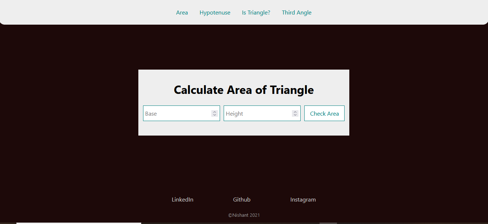

# Triangles

A ReactJS App to do the following:

- Calculate Area of a Triangle.
- To Find the Hypotenuse of a right Triangle.
- To find third angle if two angles are given.
- Check wheather a triangle is obtuse, acute or right.

> This project is part of neog.camp. It is mark 11 <b>Triangles</b>.
> 
